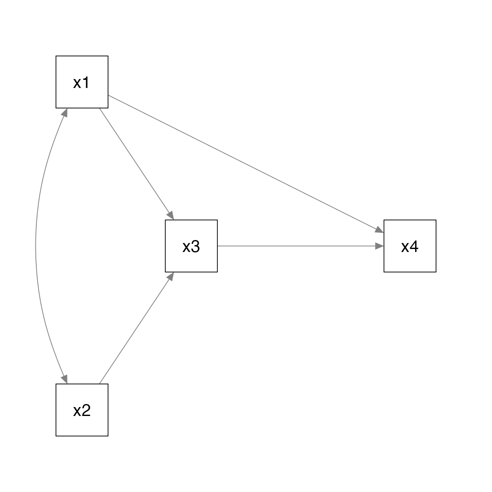
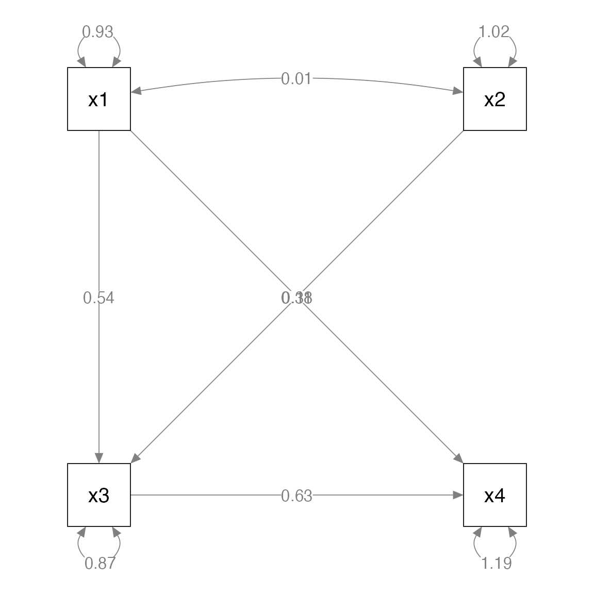
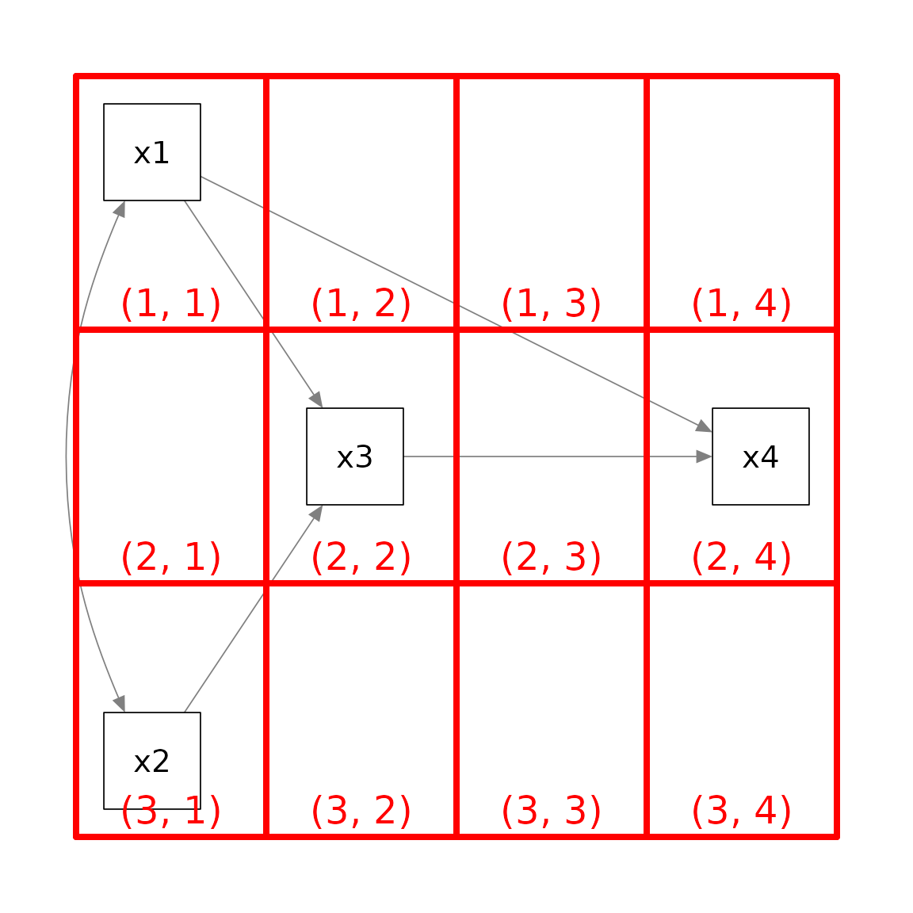
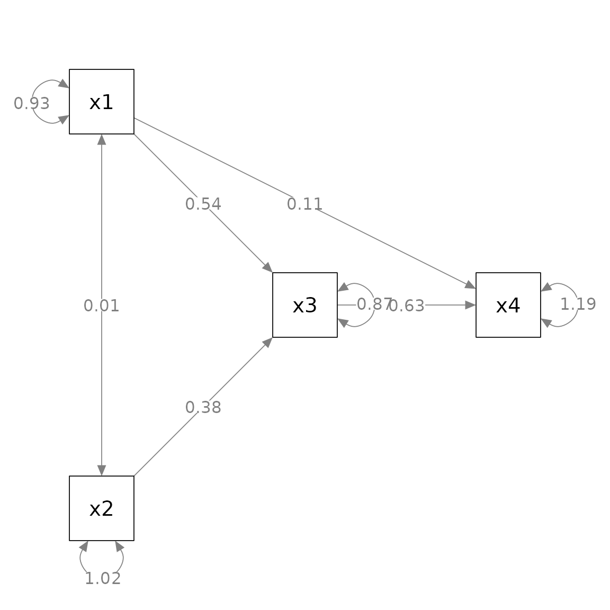
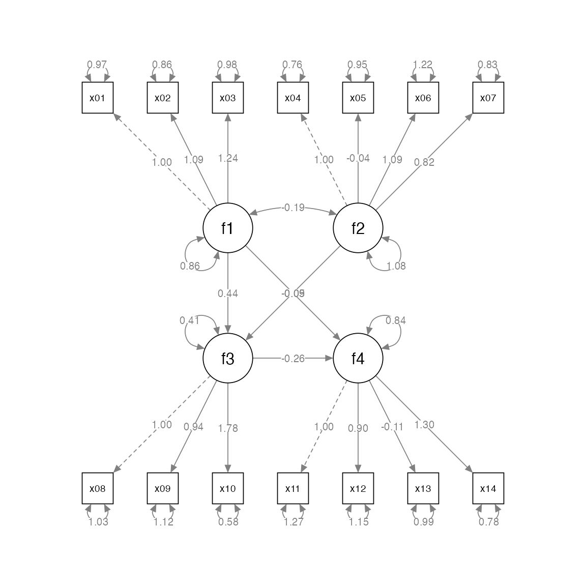
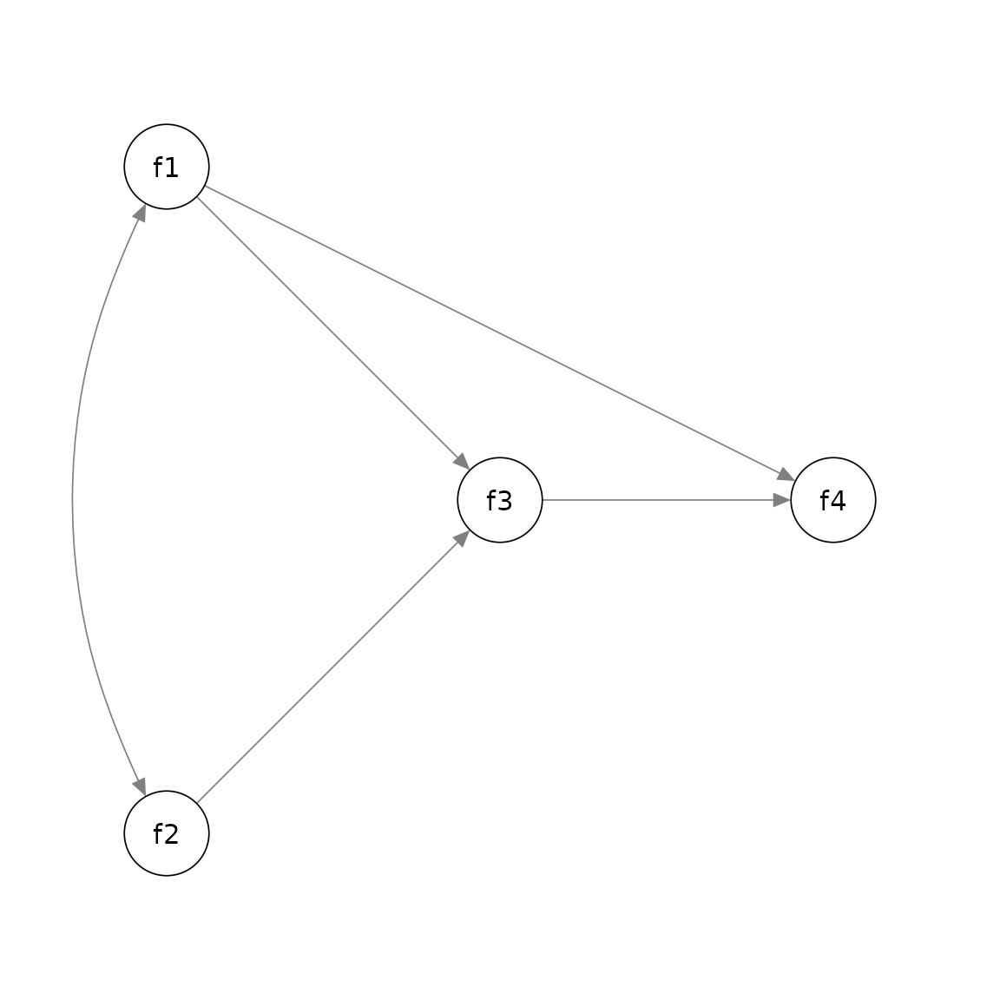
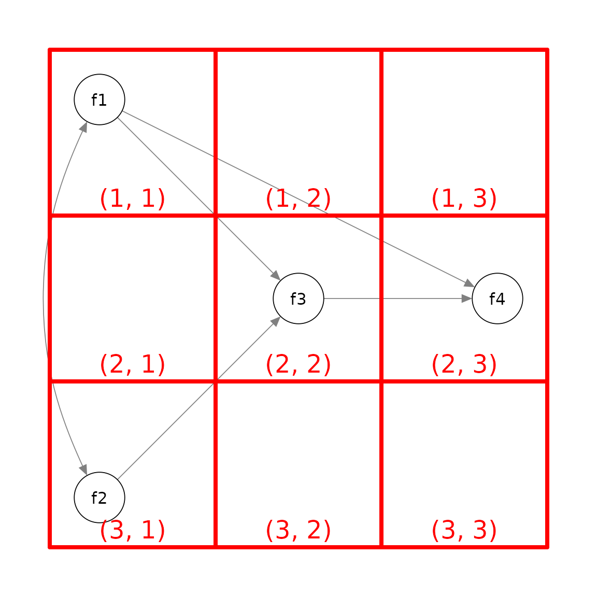
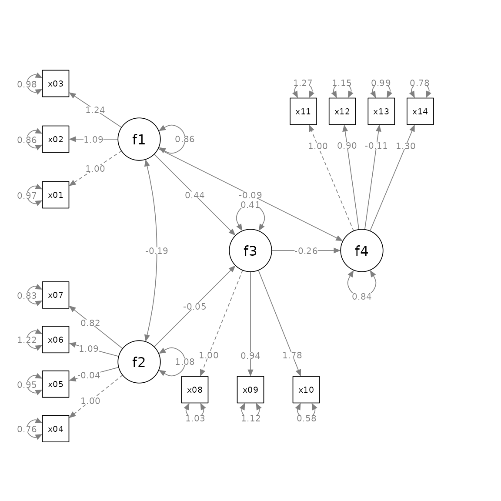

# Layout Matrices

## Introduction

One useful feature of
[`semPlot::semPaths()`](https://rdrr.io/pkg/semPlot/man/semPaths.html)
from the package [semptools](https://sfcheung.github.io/semptools/)
([CRAN page](https://cran.r-project.org/package=semptools)) is using
setting the argument `layout` to a layout matrix to specify the location
of each node in a structural equation model. This guide briefly explains
how to use `layout`, and then introduces the helper function
[`layout_matrix()`](https://sfcheung.github.io/semptools/reference/layout_matrix.md)
of `semptools` that can be used to construct a layout matrix. Last, it
describes how `factor_layout` is used in
[`set_sem_layout()`](https://sfcheung.github.io/semptools/reference/set_sem_layout.md)
to specify the layout of the latent factors only, and let
[`set_sem_layout()`](https://sfcheung.github.io/semptools/reference/set_sem_layout.md)
decide the positions of their indicators.

## What `layout` Does in `semPlot::semPaths`.

Suppose we have a path model with four variables, `x1`, `x2`, `x3`, and
`x4`. `x1` and `x2` affects `x3`, and `x1` and `x3` affects `x4`. In
psychology, this model is usually presented this way:



If we fit the model by
[`lavaan::lavaan()`](https://rdrr.io/pkg/lavaan/man/lavaan.html) and use
[`semPlot::semPaths()`](https://rdrr.io/pkg/semPlot/man/semPaths.html)
to generate the plot without using `layout`, this is the resulting plot:

``` r
library(lavaan)
library(semPlot)
mod_pa <-
 'x1 ~~ x2
  x3 ~  x1 + x2
  x4 ~  x1 + x3
 '
fit_pa <- lavaan::sem(mod_pa, pa_example)
p_pa <- semPaths(fit_pa, whatLabels = "est",
           sizeMan = 10,
           edge.label.cex = 1.15,
           style = "ram",
           nCharNodes = 0, nCharEdges = 0)
```



This layout is different from the convention used in psychology.

To use `layout`, we first decide the grid to be used to position the
variable (nodes). For example, for the conceptual diagram, we can try a
3 by 4 grid



The pair of numbers in each cell denote the location of the cell in a 3
by 4 matrix as indexed in an R matrix. An empty column was added between
`x3` and `x4` because we want to move `x4` further away to the right.

We then create a matrix of the same dimension as the grid, and
initialize the cells by `NA`, which denoted a cell with *nothing*.

``` r
m <- matrix(NA, 3, 4)
m
#>      [,1] [,2] [,3] [,4]
#> [1,]   NA   NA   NA   NA
#> [2,]   NA   NA   NA   NA
#> [3,]   NA   NA   NA   NA
```

We then set the position of each variable (node, as called internally in
a plot by
[`semPlot::semPaths()`](https://rdrr.io/pkg/semPlot/man/semPaths.html))
by setting the corresponding cell to the name of this variable as
appeared in the `lavaan` model.

``` r
m[1, 1] <- "x1"
m[3, 1] <- "x2"
m[2, 2] <- "x3"
m[2, 4] <- "x4"
m
#>      [,1] [,2] [,3] [,4]
#> [1,] "x1" NA   NA   NA  
#> [2,] NA   "x3" NA   "x4"
#> [3,] "x2" NA   NA   NA
```

We can then set `layout` to this matrix to tell
[`semPlot::semPaths()`](https://rdrr.io/pkg/semPlot/man/semPaths.html)
how to position the four variables:

``` r
p_pa <- semPaths(fit_pa, whatLabels = "est",
           sizeMan = 10,
           edge.label.cex = 1.15,
           style = "ram",
           nCharNodes = 0, nCharEdges = 0,
           layout = m)
```


Alternatively, we can type the matrix as it would appear if printed, and
set `byrow = TRUE`:

``` r
m <- matrix(c("x1",   NA,  NA,   NA,
                NA, "x3",  NA, "x4",
              "x2",   NA,  NA,   NA), byrow = TRUE, 3, 4)
m
#>      [,1] [,2] [,3] [,4]
#> [1,] "x1" NA   NA   NA  
#> [2,] NA   "x3" NA   "x4"
#> [3,] "x2" NA   NA   NA
```

We need to type more because we need to include `NA` for all the empty
cells. However, this approach let us see immediately how the variables
will be positioned. We just place the variables in the target cell,
without knowing the coordinates. This is a WYSIWYG
(what-you-see-is-what-you-get) approach. This is the approach used in
the Quick Start Guides.

## `layout_matrix()` in `semptools`

The WYSIWYG approach in the previous section has one drawback: It is not
easy to change the position of the variables and the dimension of the
grid. In real research, trial-and-error is usually needed to find a
desirable layout. For example, if we want to add a column or row, we
need ty type several `NA`s to crate it.

The
[`layout_matrix()`](https://sfcheung.github.io/semptools/reference/layout_matrix.md)
function in `semptools` is designed to generate the matrix using the
coordinates of the variables. Instead of specifying the dimension
ourselves,
[`layout_matrix()`](https://sfcheung.github.io/semptools/reference/layout_matrix.md)
will try to figure out the dimension based on the coordinates
automatically.

For example, to generate the same layout above, we can do this:

``` r
m2 <- layout_matrix(x1 = c(1, 1),
                    x2 = c(3, 1),
                    x3 = c(2, 2),
                    x4 = c(2, 4))
m2
#>      [,1] [,2] [,3] [,4]
#> [1,] "x1" NA   NA   NA  
#> [2,] NA   "x3" NA   "x4"
#> [3,] "x2" NA   NA   NA
p_pa <- semPaths(fit_pa, whatLabels = "est",
           sizeMan = 10,
           edge.label.cex = 1.15,
           style = "ram",
           nCharNodes = 0, nCharEdges = 0,
           layout = m2)
```


Suppose we want to move `x4` closer to `x3`. Instead of deleting the 3rd
columns of `NA`, we can just change the coordinates of `x4` in
[`layout_matrix()`](https://sfcheung.github.io/semptools/reference/layout_matrix.md):

``` r
m3 <- layout_matrix(x1 = c(1, 1),
                    x2 = c(3, 1),
                    x3 = c(2, 2),
                    x4 = c(2, 3))
m3
#>      [,1] [,2] [,3]
#> [1,] "x1" NA   NA  
#> [2,] NA   "x3" "x4"
#> [3,] "x2" NA   NA
p_pa <- semPaths(fit_pa, whatLabels = "est",
           sizeMan = 10,
           edge.label.cex = 1.15,
           style = "ram",
           nCharNodes = 0, nCharEdges = 0,
           layout = m3)
```



The best approach to specify the layout depends on the situation at
hand. During the trial-and-error phrase, using
[`layout_matrix()`](https://sfcheung.github.io/semptools/reference/layout_matrix.md)
is good for changing the layout. When the layout has been finalized, for
readability, typing the matrix row-by-row may be better (although we can
still use
[`layout_matrix()`](https://sfcheung.github.io/semptools/reference/layout_matrix.md)
to form the matrix and then print the matrix, as we did above).

## `factor_layout` in `set_sem_layout()`

If we use `layout` in
[`semPlot::semPaths()`](https://rdrr.io/pkg/semPlot/man/semPaths.html)
for a structural models with latent factors and we want to draw both the
factors and their indicators, we need to specify the positions of *all*
nodes, that is, all the indicators and all the factors. The grid will be
very large and it is difficult to determine the positions of the
indicators.

The `factor_layout` argument in
[`set_sem_layout()`](https://sfcheung.github.io/semptools/reference/set_sem_layout.md)
is developed to solve this problem. It works like `layout` in
[`semPlot::semPaths()`](https://rdrr.io/pkg/semPlot/man/semPaths.html).
In
[`set_sem_layout()`](https://sfcheung.github.io/semptools/reference/set_sem_layout.md),
we only need to specify the positions of the latent factors. As in
`layout`, we create a matrix to specify the positions of the factors.
The procedure is identical to what illustrated above for a path model,
and all the approaches presented above can be used. The only difference
is, only the names of the *latent* *factors* need to be present in the
matrix, and the size of the grid only need to consider the factors.

For example, suppose we have 14 indicators and four factors, and this is
the model:

``` r
mod <-
  'f1 =~ x01 + x02 + x03
   f2 =~ x04 + x05 + x06 + x07
   f3 =~ x08 + x09 + x10
   f4 =~ x11 + x12 + x13 + x14
   f3 ~  f1 + f2
   f4 ~  f1 + f3
  '
```

If we want to draw both the factors and the indicators, the plot will
have 18 nodes:

``` r
fit <- lavaan::sem(mod, cfa_example)
p <- semPaths(fit, whatLabels="est",
        sizeMan = 5,
        node.width = 1,
        edge.label.cex = .75,
        style = "ram",
        mar = c(5, 5, 5, 5))
```



Suppose we want to position the factors this way:



Again, we decide the grid to use, which is 3 by 3 in this example:



Therefore, this is the matrix to be used:

``` r
m_sem <- layout_matrix(f1 = c(1, 1),
                    f2 = c(3, 1),
                    f3 = c(2, 2),
                    f4 = c(2, 3))
m_sem
#>      [,1] [,2] [,3]
#> [1,] "f1" NA   NA  
#> [2,] NA   "f3" "f4"
#> [3,] "f2" NA   NA
```

Note that
[`layout_matrix()`](https://sfcheung.github.io/semptools/reference/layout_matrix.md)
can also be used to set up the orientation of the indicators of each
factor:

``` r
point_to <- layout_matrix(left = c(1, 1),
                          left = c(3, 1),
                          down = c(2, 2),
                          up = c(2, 3))
```

We can then use this matrix in
[`set_sem_layout()`](https://sfcheung.github.io/semptools/reference/set_sem_layout.md)
(please refer to
[`vignette("quick_start_sem")`](https://sfcheung.github.io/semptools/articles/quick_start_sem.md)
or
[`?set_sem_layout`](https://sfcheung.github.io/semptools/reference/set_sem_layout.md)
on how to specify other arguments):

``` r
indicator_order  <- c("x04", "x05", "x06", "x07",
                      "x01", "x02", "x03",
                      "x11", "x12", "x13", "x14",
                      "x08", "x09", "x10")
indicator_factor <- c( "f2",  "f2",  "f2",  "f2",
                       "f1",  "f1",  "f1",
                       "f4",  "f4",  "f4",  "f4",
                       "f3",  "f3",  "f3")
indicator_push <- c(f3 = 2.5,
                    f4 = 2.5,
                    f1 = 1.5,
                    f2 = 1.5)
indicator_spread <- c(f1 = 2,
                      f2 = 2,
                      f3 = 2,
                      f4 = 1.75)
loading_position <- c(f2 = .6,
                      f3 = .8,
                      f4 = .8)
p2 <- set_sem_layout(p,
                     indicator_order = indicator_order,
                     indicator_factor = indicator_factor,
                     factor_layout = m_sem,
                     factor_point_to = point_to,
                     indicator_push = indicator_push,
                     indicator_spread = indicator_spread,
                     loading_position = loading_position)
plot(p2)
```



This make it much easier to specify the positions of factors in a
structural equation model with latent factors.
