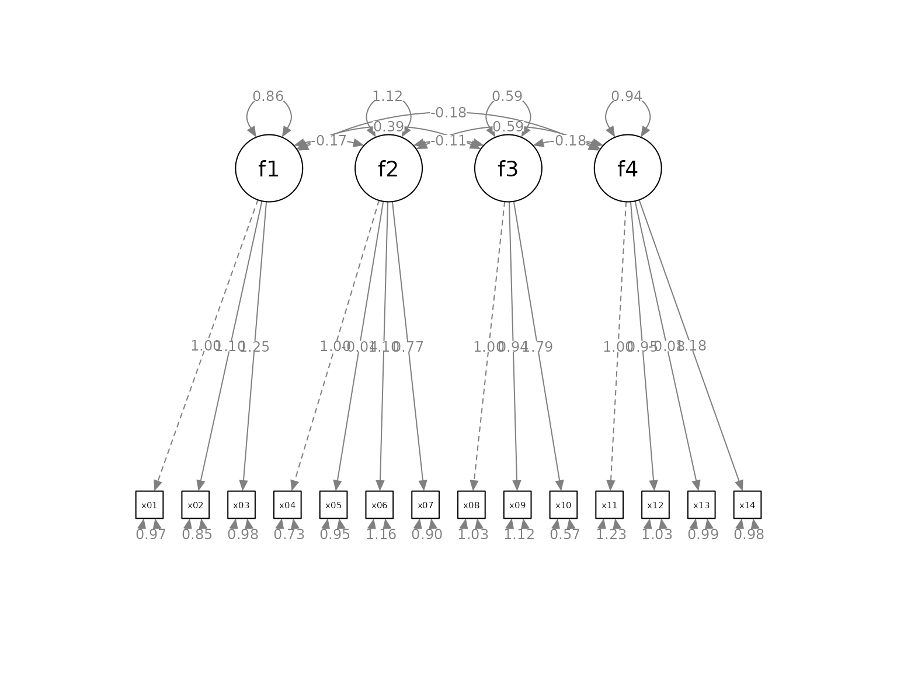
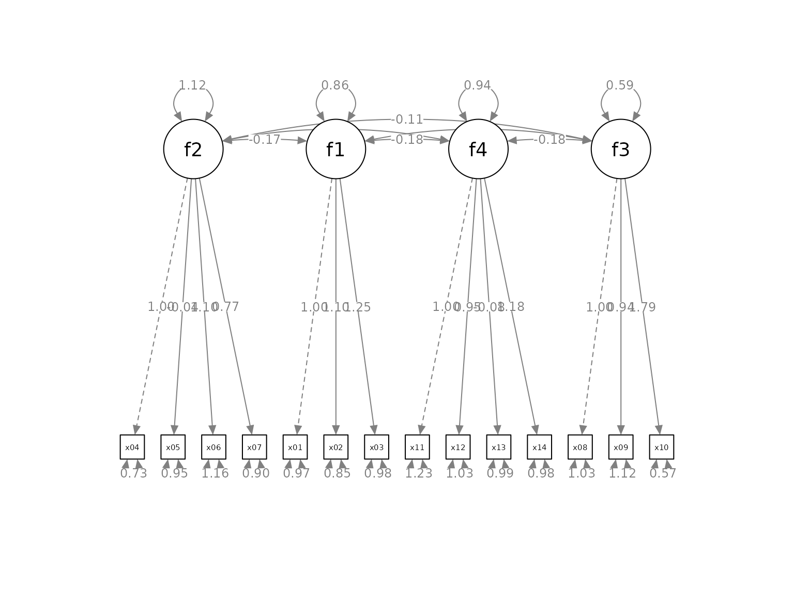
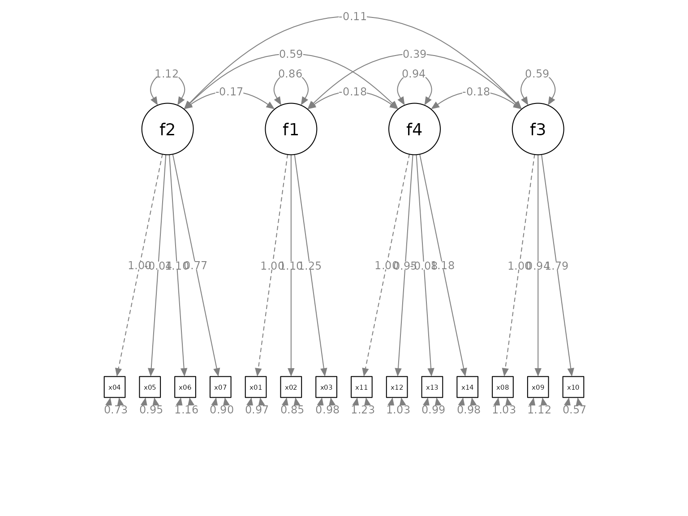
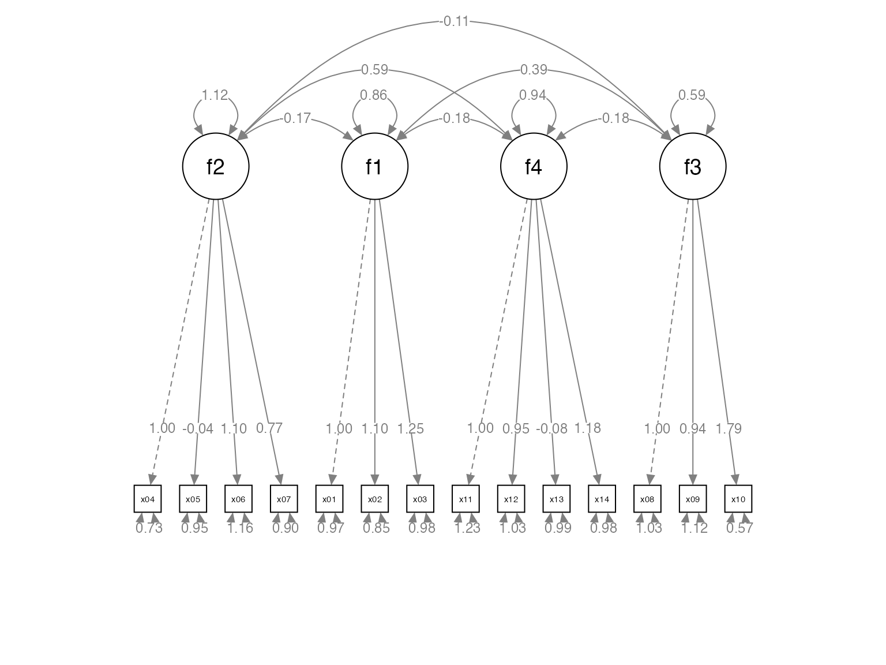
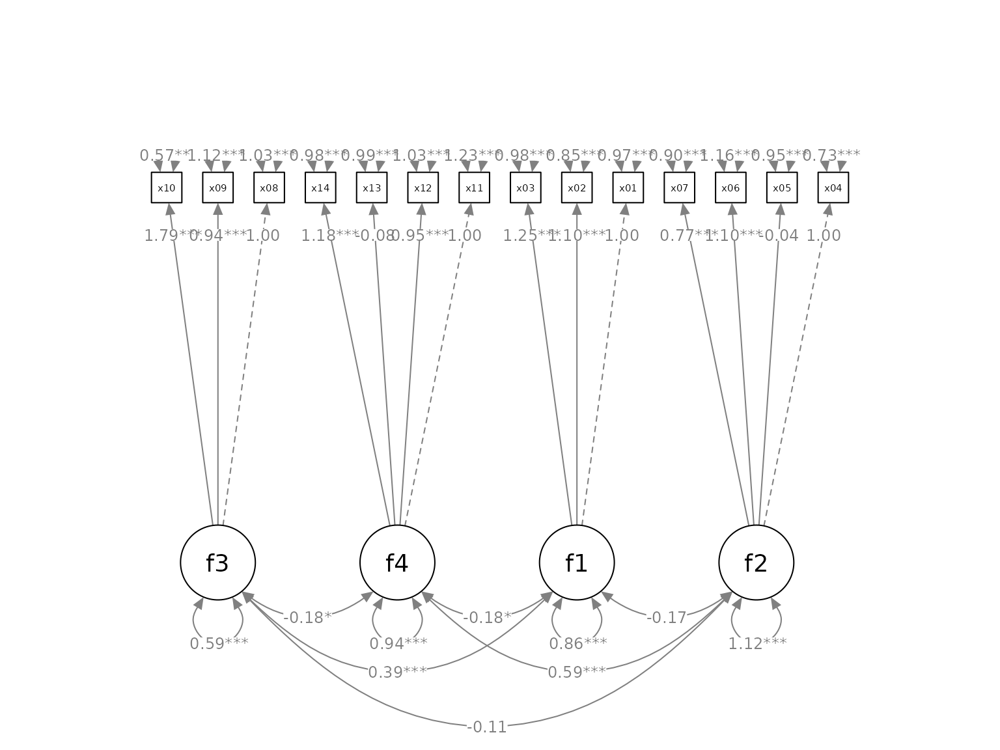

# Quick Start To set_cfa_layout

## Introduction

The package [semptools](https://sfcheung.github.io/semptools/) ([CRAN
page](https://cran.r-project.org/package=semptools)) contains functions
that *post-process* an output from
[`semPlot::semPaths()`](https://rdrr.io/pkg/semPlot/man/semPaths.html),
to help users to customize the appearance of the graphs generated by
[`semPlot::semPaths()`](https://rdrr.io/pkg/semPlot/man/semPaths.html).
For the introduction to functions for doing very specific tasks, such as
moving the parameter estimate of a path or rotating the residual of a
variable, please refer to
[`vignette("semptools")`](https://sfcheung.github.io/semptools/articles/semptools.md).
The present guide focuses on how to use
[`set_cfa_layout()`](https://sfcheung.github.io/semptools/reference/set_cfa_layout.md)
to configure various aspects of an `semPaths` graph generated for a
typical confirmatory factor analysis (CFA) model.

## The Initial semPaths Graph

Let us consider a CFA model. We will use `cfa_example`, a sample CFA
dataset from `semptools` with 14 variables for illustration.

``` r
library(semptools)
head(round(cfa_example, 3), 3)
#>      x01    x02    x03    x04    x05    x06    x07   x08   x09    x10    x11
#> 1  1.159  1.271  1.451 -0.691 -0.015 -0.212 -0.336 1.559 0.870  1.115 -1.251
#> 2  0.059 -0.496 -0.585 -1.800 -0.555  0.012  1.208 0.551 0.055 -0.365 -0.142
#> 3 -0.737  2.933  1.625  0.642 -1.218 -0.155 -0.861 0.862 0.738  2.443 -0.628
#>     x12    x13    x14
#> 1 0.253  0.663 -1.049
#> 2 0.110 -0.207 -0.226
#> 3 1.604 -1.688  0.395
```

This is the CFA model to be fitted:

``` r
mod <-
  'f1 =~ x01 + x02 + x03
   f2 =~ x04 + x05 + x06 + x07
   f3 =~ x08 + x09 + x10
   f4 =~ x11 + x12 + x13 + x14
  '
```

Fitting the model by
[`lavaan::cfa()`](https://rdrr.io/pkg/lavaan/man/cfa.html)

``` r
library(lavaan)
#> This is lavaan 0.6-21
#> lavaan is FREE software! Please report any bugs.
fit <- lavaan::cfa(mod, cfa_example)
```

This is the plot from
[`semPlot::semPaths()`](https://rdrr.io/pkg/semPlot/man/semPaths.html):

``` r
library(semPlot)
p <- semPaths(fit, whatLabels="est",
        sizeMan = 3.25,
        node.width = 1,
        edge.label.cex = .75,
        style = "ram",
        mar = c(10, 5, 10, 5))
```



The default layout is sufficient to have a quick examination of the
results. We will see how
[`set_cfa_layout()`](https://sfcheung.github.io/semptools/reference/set_cfa_layout.md)
can be used to do the following tasks to *post-process* the graph:

- Change the order of the indicators.

- Change the order of the factors.

- Change the curvature of the inter-factor covariances.

- Move the loadings along the paths from factors to indicators.

- Rotate the graph.

## Order the Indicators and Factors

Suppose we want to do this:

- Order the factors this way, from the left to the right:

  - `f2, f1, f4, f3`

- Order the indicators this way, from the left to the right:

  - `x04, x05, x06, x07, x01, x02, x03, x11, x12, x13, x14, x08, x09, x10`

- We would like to place the factors this way:

  - `f2` above the center of `x04`, `x05`, `x06`, and `x07`.

  - `f1` above the center of `x01`, `x02`, and `x03`.

  - `f4` above the center of `x11`, `x12`, `x13`, and `x14`.

  - `f3` above the center of `x08`, `x09`, and `x10`.

To do this, we create two vectors, one for the argument
`indicator_order` and the other for the argument `indicator_factor`.

- `indicator_order` is a string vector with length equal to the number
  of indicators, with the desired order. In this example, it will be
  like this:

``` r
indicator_order  <- c("x04", "x05", "x06", "x07",
                      "x01", "x02", "x03",
                      "x11", "x12", "x13", "x14",
                      "x08", "x09", "x10")
```

- `indicator_factor` is a string vector with length equal to the number
  of indicators. The elements are the names of the latent factors,
  denoting which indicators will be used to compute the mean positions
  to place the latent factors:

``` r
indicator_factor <- c( "f2",  "f2",  "f2",  "f2",
                       "f1",  "f1",  "f1",
                       "f4",  "f4",  "f4",  "f4",
                       "f3",  "f3",  "f3")
```

The
[`set_cfa_layout()`](https://sfcheung.github.io/semptools/reference/set_cfa_layout.md)
function needs at least three arguments:

- `semPaths_plot`: The `semPaths` plot.

- `indicator_order`: The vector for the order of indicators.

- `indicator_factor`: The vector for the placement of the latent
  factors.

They do not have to be named if they are in this order.

We now use
[`set_cfa_layout()`](https://sfcheung.github.io/semptools/reference/set_cfa_layout.md)
to post-process the graph:

``` r
p2 <- set_cfa_layout(p,
                     indicator_order,
                     indicator_factor)
plot(p2)
```



## Change the Curvatures of the Factor Covariances

The graph has the factors and indicators ordered as required. However,
the inter-factor covariances are too close to the factors. To increases
the curvatures of the covariances, we can use the argument `fcov_curve`.
The default is .4. Let us increase it to 1.75.

``` r
p2 <- set_cfa_layout(p,
                     indicator_order,
                     indicator_factor,
                     fcov_curve = 1.75)
plot(p2)
```



The covariances are now more readable. The exact effect of the values
vary from graph to graph. Therefore, trial and error is required to find
a value suitable for a graph.

## Move the Loadings

We can also move all the factor loadings together using the argument
`loading_position`. The default value is .5, at the middle of the paths.
If we want to move the loadings closer to the indicators, we increase
this number. If we want to move the loadings closer to the indicators,
we decrease this number. In the following example, we move the loadings
closer to the indicators, and increase the distance between them in the
process.

``` r
p2 <- set_cfa_layout(p,
                     indicator_order,
                     indicator_factor,
                     fcov_curve = 1.75,
                     loading_position = .8)
plot(p2)
```



The factor loadings are now easier to read, and also closer to the
corresponding indicators.

## Rotate the Model

The default orientation is “pointing downwards”: latent factors on the
top, pointing down to the indicators on the bottom. The orientation can
be set to one of these four directions: down (default), left, up, and
right. This is done by the argument `point_to`.

``` r
p2 <- set_cfa_layout(p,
                     indicator_order,
                     indicator_factor,
                     fcov_curve = 1.75,
                     loading_position = .8,
                     point_to = "up")
plot(p2)
```


## Pipe

Like other functions in `semptools`, the
[`set_cfa_layout()`](https://sfcheung.github.io/semptools/reference/set_cfa_layout.md)
function can be chained with other functions using the pipe operator,
`%>%`, from the package `magrittr`, or the native pipe operator `|>`
available since R 4.1.x. Suppose we want to mark the significant test
results for the free parameters using
[`mark_sig()`](https://sfcheung.github.io/semptools/reference/mark_sig.md):

``` r
# If R version >= 4.1.0
p2 <- set_cfa_layout(p,
                     indicator_order,
                     indicator_factor,
                     fcov_curve = 1.75,
                     loading_position = .9,
                     point_to = "up") |>
      mark_sig(fit)
plot(p2)
```

    #> Loading required package: magrittr



## Limitations

- Currently, if a function needs the SEM output, only lavaan output is
  supported.
