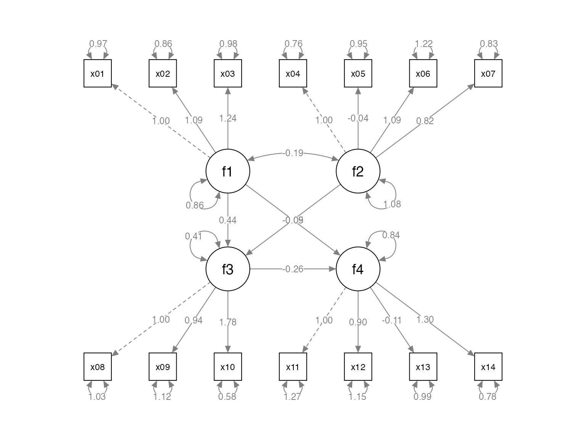
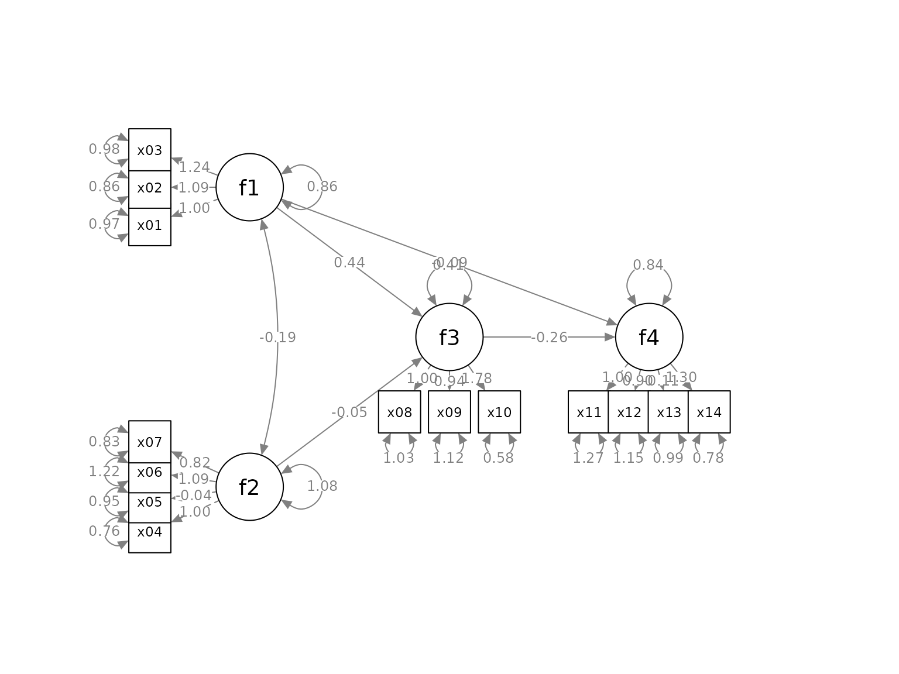
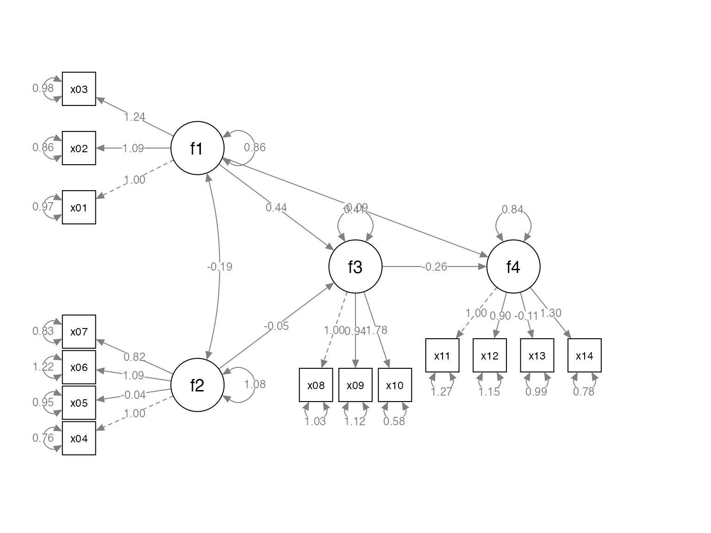
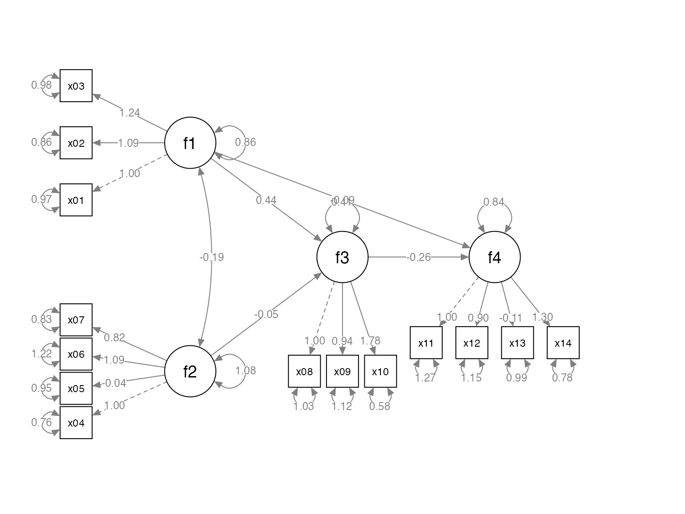

# Quick Start To set_sem_layout

## Introduction

The package [semptools](https://sfcheung.github.io/semptools/) ([CRAN
page](https://cran.r-project.org/package=semptools)) contains functions
that *post-process* an output from
[`semPlot::semPaths()`](https://rdrr.io/pkg/semPlot/man/semPaths.html),
to help users to customize the appearance of the graphs generated by
[`semPlot::semPaths()`](https://rdrr.io/pkg/semPlot/man/semPaths.html).
For the introduction to functions for doing very specific tasks, such as
moving the parameter estimate of a path or rotating the residual of a
variable, please refer to
[`vignette("semptools")`](https://sfcheung.github.io/semptools/articles/semptools.md).
The present guide focuses on how to use
[`set_sem_layout()`](https://sfcheung.github.io/semptools/reference/set_sem_layout.md)
to configure various aspects of a `semPaths` graph generated for a
typical structural equation model (SEM) with latent factors. For
configuring the layout of a confirmatory factor analysis (CFA) model
with no structural path between factors, please refer to the
[`vignette("quick_start_cfa")`](https://sfcheung.github.io/semptools/articles/quick_start_cfa.md).

## The Initial `semPaths` Graph

Let us consider an SEM model. We will use `sem_example`, a sample CFA
dataset from semptools with 14 variables for illustration.

``` r

library(semptools)
head(round(sem_example, 3), 3)
#>      x01    x02    x03    x04    x05    x06    x07    x08    x09    x10   x11
#> 1  2.861  2.289  3.381  0.191  0.095 -0.395 -0.060  1.320  2.807  2.330 2.069
#> 2 -0.246 -1.299 -0.371  2.232 -0.419 -0.565 -0.162  3.050  1.513  1.777 2.991
#> 3  0.079  0.067  0.323 -3.043 -1.093 -0.626 -1.961 -4.908 -2.048 -3.190 1.403
#>     x12    x13   x14
#> 1 0.569 -0.808 1.989
#> 2 2.125  0.767 1.539
#> 3 1.888  1.356 1.107
```

This is the SEM model to be fitted:

``` r

mod <-
  'f1 =~ x01 + x02 + x03
   f2 =~ x04 + x05 + x06 + x07
   f3 =~ x08 + x09 + x10
   f4 =~ x11 + x12 + x13 + x14
   f3 ~  f1 + f2
   f4 ~  f1 + f3
  '
```

Fitting the model using
[`lavaan::sem()`](https://rdrr.io/pkg/lavaan/man/sem.html):

``` r

library(lavaan)
#> This is lavaan 0.6-21
#> lavaan is FREE software! Please report any bugs.
fit <- lavaan::sem(mod, cfa_example)
```

This is the plot from `semPaths`:

``` r

library(semPlot)
p <- semPaths(fit, whatLabels="est",
        sizeMan = 5,
        node.width = 1,
        edge.label.cex = .75,
        style = "ram",
        mar = c(5, 5, 5, 5))
```



We will see how
[`set_sem_layout()`](https://sfcheung.github.io/semptools/reference/set_sem_layout.md)
can be used to do the following tasks to *post-process* the graph:

- Change the order of the indicators.

- Assign factors to indicators manually.

- Specify how to set the approximate positions of the factors.

- Specify how to place the indicators of a factor.

- Adjust the placement of the indicators relative to their corresponding
  factors.

- Move the loadings along the paths from factors to indicators.

## Assign Indicators to Factors

This section describes how to set the order of the indicators, assign
them to factors, and specify the approximate positions of the factors.

Suppose we want to do this:

- We would like to assign the indicators to the factors this way:

  - `x04`, `x05`, `x06`, and `x07` for `f2`.

  - `x01`, `x02`, and `x03` for `f1`.

  - `x11`, `x12`, `x13`, and `x14` for `f4`.

  - `x08`, `x09`, and `x10` for `f3`.

To do this, we create two vectors, one for the argument
`indicator_order` and the other for the argument `indicator_factor`.

- `indicator_order` is a string vector with length equal to the number
  of indicators, with the desired order if the indicators are placed
  *above* the corresponding factors. In this example, it will be like
  this:

``` r

indicator_order  <- c("x04", "x05", "x06", "x07",
                      "x01", "x02", "x03",
                      "x11", "x12", "x13", "x14",
                      "x08", "x09", "x10")
```

- `indicator_factor` is a string vector with length equal to the number
  of indicators. The elements are the names of the latent factors,
  denoting which factor each indicator will be assigned to:

``` r

indicator_factor <- c( "f2",  "f2",  "f2",  "f2",
                       "f1",  "f1",  "f1",
                       "f4",  "f4",  "f4",  "f4",
                       "f3",  "f3",  "f3")
```

To specify the locations of the factors, we need two more arguments,
`factor_layout` and `factor_point_to`.

`factor_layout` is a matrix of arbitrary size, with either `NA` or the
name of a factor. For example:

``` r

factor_layout <- matrix(c("f1",   NA,   NA,
                           NA, "f3", "f4",
                         "f2",   NA,   NA), byrow = TRUE, 3, 3)
```

This sets up a 3-by-3 grid, with `f1` on the top left, `f2` on the
bottom left, `f3` in the center, and `f4` on the right of `f3`. Each
factor must be in one and only one cell of this matrix.

Note that a column or row can contain only `NA`, to increase the
vertical or horizontal distance between factors.

The helper function
[`layout_matrix()`](https://sfcheung.github.io/semptools/reference/layout_matrix.md)
can also be used to create the matrix to be used in `factor_layout` (see
[`vignette("layout_matrix")`](https://sfcheung.github.io/semptools/articles/layout_matrix.md)
on how to use
[`layout_matrix()`](https://sfcheung.github.io/semptools/reference/layout_matrix.md)):

``` r

factor_layout <- layout_matrix(f1 = c(1, 1),
                               f2 = c(3, 1),
                               f3 = c(2, 2),
                               f4 = c(2, 3))
factor_layout
#>      [,1] [,2] [,3]
#> [1,] "f1" NA   NA  
#> [2,] NA   "f3" "f4"
#> [3,] "f2" NA   NA
```

`factor_point_to` is a matrix of the size as `factor_layout`, with
either `NA` or one of these: “down”, “left”, “up”, or “right”, to
indicate the direction that a factor “points to” its indicator. For
example:

``` r

factor_point_to <- matrix(c("left",     NA,      NA,
                                NA, "down", "down",
                            "left",     NA,      NA), byrow = TRUE, 3, 3)
```

`f1` and `f2` will point to the left (i.e., indicators on the left),
`f3` and `f4` will point downwards.

[`layout_matrix()`](https://sfcheung.github.io/semptools/reference/layout_matrix.md)
can also be used to create this matrix:

``` r

factor_point_to <- layout_matrix(left = c(1, 1),
                                 left = c(3, 1),
                                 down = c(2, 2),
                                 down = c(2, 3))
factor_point_to
#>      [,1]   [,2]   [,3]  
#> [1,] "left" NA     NA    
#> [2,] NA     "down" "down"
#> [3,] "left" NA     NA
```

In sum, the
[`set_sem_layout()`](https://sfcheung.github.io/semptools/reference/set_sem_layout.md)
function needs at least these arguments:

- `semPaths_plot`: The `semPaths` plot.

- `indicator_order`: The vector for the order of indicators.

- `indicator_factor`: The vector for assigning indicators to latent
  factors.

- `factor_layout`: The position of the factors on a grid.

- `factor_point_to`: The placement of the indicators.

They do not have to be named if they are in this order.

We now use
[`set_sem_layout()`](https://sfcheung.github.io/semptools/reference/set_sem_layout.md)
to post-process the graph:

``` r

p2 <- set_sem_layout(p,
                     indicator_order = indicator_order,
                     indicator_factor = indicator_factor,
                     factor_layout = factor_layout,
                     factor_point_to = factor_point_to)
plot(p2)
```



## Move Indicators

The placement of the indicators are too close to the indicators and to
neighboring indicators. We can adjust the relative position in two ways.

### “Push” the indicators away

We can use the argument `indicator_push` to push the indicators of a
factor away from it. The argument needs a named vector. The name is the
factor of which the indictors will be “pushed”, and the value is how
“hard” the push is: the multiplier to the distance from the factor to
the indicators. For example:

``` r

indicator_push <- c(f3 = 2,
                    f4 = 1.5,
                    f1 = 1.5,
                    f2 = 1.5)
```

This vector will double the distance between the indicators of `f3` and
their factors, and multiply the distance between the indicators of `f4`,
`f1`, and `f2` and their factors by 1.5. If `push` is less than 1, the
indicators will be “pulled” towards their factors.

``` r

p2 <- set_sem_layout(p,
                     indicator_order = indicator_order,
                     indicator_factor = indicator_factor,
                     factor_layout = factor_layout,
                     factor_point_to = factor_point_to,
                     indicator_push = indicator_push)
plot(p2)
```



### “Spread” out the indicators

We can use the argument `indicator_spread` to spread out the indicators
of a factor, increasing the distance between the indicators. The
argument needs a named vector. The name is the factor of which the
indicators will be spread out. The value is the multiplier to the
distance between neighboring indicators. For example:

``` r

indicator_spread <- c(f1 = 2,
                      f2 = 1.5,
                      f4 = 1.5)
```

This vector will double the distance between the indicators of `f1`, and
multiply the distance between the indicators of `f2` and `f4`. and its
indicators by 1.5. If `spread` is less than 1, the indicators will be
squeezed towards each others.

``` r

p2 <- set_sem_layout(p,
                     indicator_order = indicator_order,
                     indicator_factor = indicator_factor,
                     factor_layout = factor_layout,
                     factor_point_to = factor_point_to,
                     indicator_push = indicator_push,
                     indicator_spread = indicator_spread)
plot(p2)
```


## Move the Loadings

We can move the loadings of indicators along the paths by the argument
`loading_position`. If we supply one single number, from 0 to 1, this
number will be used for the position of all loadings. A value of .5
place the loadings on the middle of the paths. Larger the value, closer
the loadings to the indicators. Smaller the value, closer the loadings
to the factors.

We can also use a named vector to specify the positions of indicators
for each factor.In each element, the name if the factor whose loadings
will be moved. The value is the positions of its loadings. The default
is .50. We only need to specify the positions for factors to be changed
from .50 to other values. For example:

``` r

loading_position <- c(f2 = .7,
                      f3 = .8,
                      f4 = .8)
```

``` r

p2 <- set_sem_layout(p,
                     indicator_order = indicator_order,
                     indicator_factor = indicator_factor,
                     factor_layout = factor_layout,
                     factor_point_to = factor_point_to,
                     indicator_push = indicator_push,
                     indicator_spread = indicator_spread,
                     loading_position = loading_position)
plot(p2)
```



## Pipe

Like other functions in `semptools`, the
[`set_sem_layout()`](https://sfcheung.github.io/semptools/reference/set_sem_layout.md)
function can be chained with other functions using the pipe operator,
`%>%`, from the package `magrittr`, or the native pipe operator `|>`
available since R 4.1.x. Suppose we want to mark the significant test
results for the free parameters using
[`mark_sig()`](https://sfcheung.github.io/semptools/reference/mark_sig.md),
and use
[`set_curve()`](https://sfcheung.github.io/semptools/reference/set_curve.md)
to change the curvature of `f1 ~~ f2` covariances and `f4 ~ f1` paths
(we push and spread some indicators to make room for the asterisks, and
change the orientation of `f4` to `up`):

``` r

# If R version >= 4.1.0
p2 <- set_sem_layout(p,
                    indicator_order = indicator_order,
                    indicator_factor = indicator_factor,
                    factor_layout = factor_layout,
                    factor_point_to = factor_point_to,
                    indicator_push = indicator_push,
                    indicator_spread = indicator_spread,
                    loading_position = loading_position) |>
                    set_curve(c("f2 ~~ f1" = -1,
                                "f4 ~ f1" = 1.5)) |>
                    mark_sig(fit)
plot(p2)
```

    #> Loading required package: magrittr


## Limitations

- Currently, if a function needs the SEM output, only lavaan output is
  supported.
