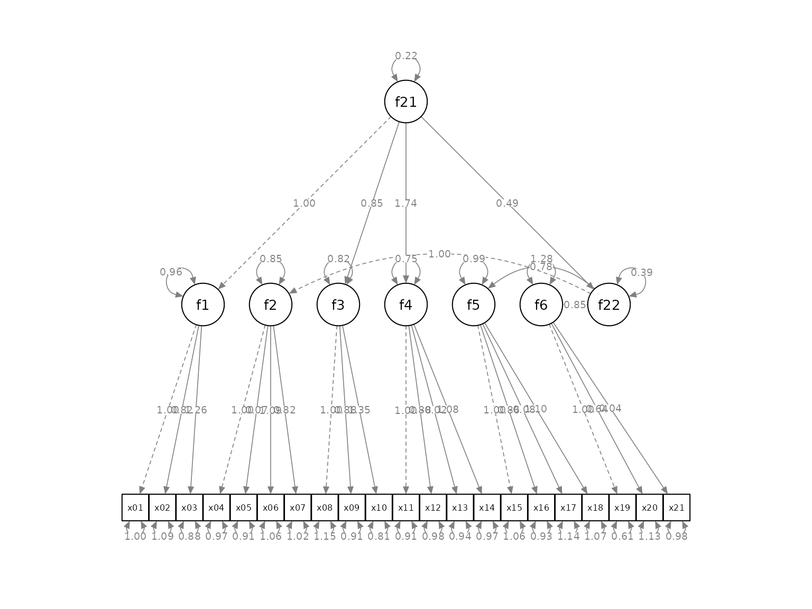
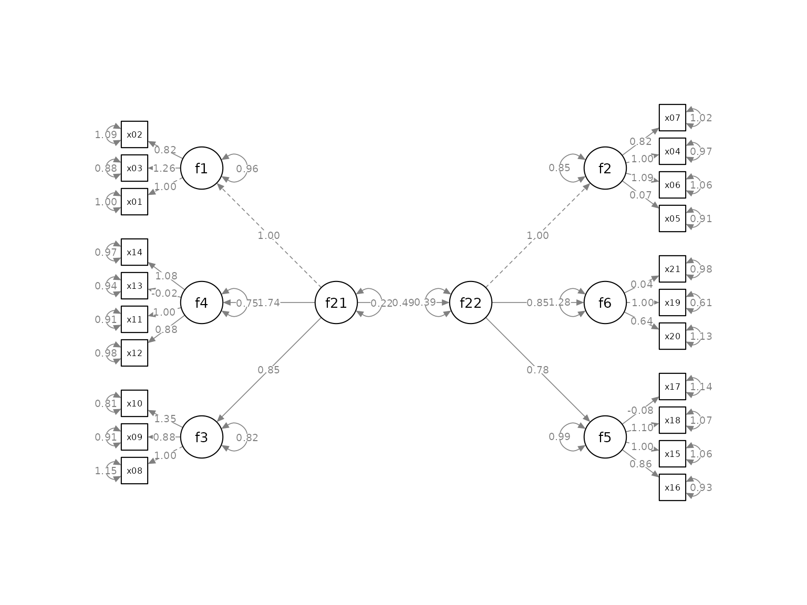
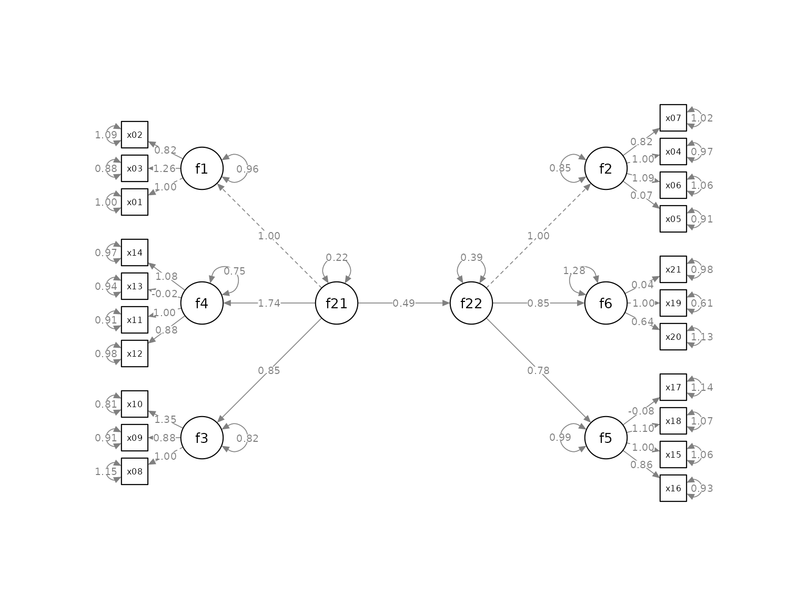

# Models with Second-Order Factors

## Introduction

This article illustrates how to use
[`set_sem_layout()`](https://sfcheung.github.io/semptools/reference/set_sem_layout.md)
from the package [semptools](https://sfcheung.github.io/semptools/)
([CRAN page](https://cran.r-project.org/package=semptools)) for a model
with second-order factors. Readers are assumed to have learned how to
use
[`set_sem_layout()`](https://sfcheung.github.io/semptools/reference/set_sem_layout.md)
(see
[`vignette("quick_start_sem")`](https://sfcheung.github.io/semptools/articles/quick_start_sem.md)).

## The Initial `semPaths` Plot

We will use `sem_2nd_order_example`, a sample SEM dataset from semptools
with 21 variables for illustration.

``` r

library(semptools)
head(round(sem_2nd_order_example, 3), 3)
#>     x01    x02   x03   x04    x05    x06    x07    x08    x09    x10    x11
#> 1 0.773  0.246 0.959 1.819 -0.193  3.025  2.311  0.403  1.722  0.758  0.645
#> 2 0.757  0.303 0.139 0.516  0.514  2.145 -0.589  1.667 -0.001  2.513  2.381
#> 3 0.665 -1.135 0.199 0.764 -0.098 -1.293  1.481 -3.501 -1.215 -1.614 -0.073
#>      x12    x13    x14   x15    x16    x17    x18    x19    x20   x21
#> 1 -0.813  0.609  1.323 1.852  0.428 -0.284 -1.106  0.509  1.111 0.483
#> 2  2.102 -0.805  2.567 1.097 -0.288 -1.007  0.530 -0.722 -0.590 1.164
#> 3 -0.150  0.639 -1.507 0.860 -0.899 -0.882 -1.275 -0.616 -0.975 0.007
```

This is the SEM model to be fitted:

``` r

mod <-
  'f1 =~ x01 + x02 + x03
   f2 =~ x04 + x05 + x06 + x07
   f3 =~ x08 + x09 + x10
   f4 =~ x11 + x12 + x13 + x14
   f5 =~ x15 + x16 + x17 + x18
   f6 =~ x19 + x20 + x21
   f21 =~ 1*f1 + f3 + f4
   f22 =~ 1*f2 + f5 + f6
   f22 ~ f21
  '
```

Fitting the model using
[`lavaan::sem()`](https://rdrr.io/pkg/lavaan/man/sem.html):

``` r

library(lavaan)
#> This is lavaan 0.6-21
#> lavaan is FREE software! Please report any bugs.
fit <- lavaan::sem(mod, sem_2nd_order_example)
```

This is the plot from `semPaths`:

``` r

library(semPlot)
p <- semPaths(fit, whatLabels = "est",
              sizeMan = 5,
              nCharNodes = 0, nCharEdges = 0,
              edge.width = 0.8, node.width = 0.7,
              edge.label.cex = 0.6,
              style = "ram",
              mar = c(5, 5, 5, 5))
```



## Modify the Plot

As described in `vignette("set_sem_layout")`, the plot can be modified
by
[`set_sem_layout()`](https://sfcheung.github.io/semptools/reference/set_sem_layout.md),
with these special treatment:

### Special Treatment

To modify a plot with second order factors:

- The “indicators” of a second-order factor need to be included in the
  vector for the `indicator_order` argument.

- In the matrix for `factor_layout`, all factors, first or second order,
  should be included.

- Although a second-order factor has latent factors as their indicators,
  the direction of a second-order factor in the `factor_point_to` matrix
  is ignored. The position of the indicators of a second-order factor
  are determined by the `factor_layout` matrix.

In the example below, `f1` to `f6`, though latent factors themselves,
are included in the vector for `indicator_order`.

### Example

``` r

indicator_order  <- c("x01", "x03", "x02",
                      "x05", "x06", "x04", "x07",
                      "x08", "x09", "x10",
                      "x12", "x11", "x13", "x14",
                      "x16", "x15", "x18", "x17",
                      "x20", "x19", "x21",
                      "f1", "f3", "f4",
                      "f5", "f6", "f2")
indicator_factor <- c("f1", "f1", "f1",
                      "f2", "f2", "f2", "f2",
                      "f3", "f3", "f3",
                      "f4", "f4", "f4", "f4",
                      "f5", "f5", "f5", "f5",
                      "f6", "f6", "f6",
                      "f21", "f21", "f21",
                      "f22", "f22", "f22")
factor_layout <- matrix(c(  NA, "f21",   NA, NA,  NA, "f22",   NA,
                          "f1",  "f4", "f3", NA, "f2",  "f6", "f5"),
                          byrow = TRUE, 2, 7)
factor_layout <- matrix(c("f1",    NA,    NA, "f2",
                          "f4", "f21", "f22", "f6",
                          "f3",    NA,    NA, "f5"),
                          byrow = TRUE, 3, 4)
factor_point_to <- matrix(c("left",     NA,      NA, "right",
                            "left", "left", "right", "right",
                            "left",     NA,      NA, "right"),
                            byrow = TRUE, 3, 4)
indicator_spread <- c(f4 = 1.25,
                      f2 = 1.25,
                      f5 = 1.25)
p2 <- set_sem_layout(p,
                     indicator_order = indicator_order,
                     indicator_factor = indicator_factor,
                     factor_layout = factor_layout,
                     factor_point_to = factor_point_to,
                     indicator_spread = indicator_spread)
```

This is the result:

``` r

plot(p2)
```



The layout is acceptable. It can be further modified by other functions
described in
[`vignette("semptools")`](https://sfcheung.github.io/semptools/articles/semptools.md).
For example, the residuals can be rotated:

``` r

my_rotate_resid_list <- c(f4  =  45,
                          f21 =   0,
                          f22 =   0,
                          f6  = -45)
p3 <- rotate_resid(p2, my_rotate_resid_list)
plot(p3)
```



## Further information

Please refer to
[`vignette("quick_start_sem")`](https://sfcheung.github.io/semptools/articles/quick_start_sem.md)
on other options of
[`set_sem_layout()`](https://sfcheung.github.io/semptools/reference/set_sem_layout.md)
and how to use it with other functions in the package.
