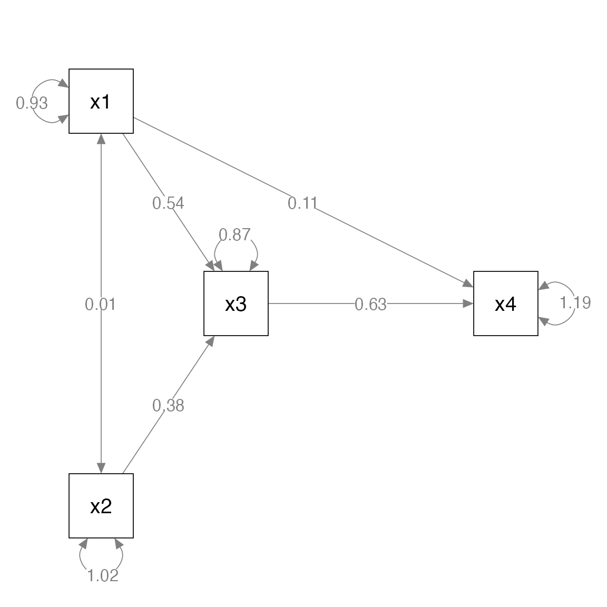
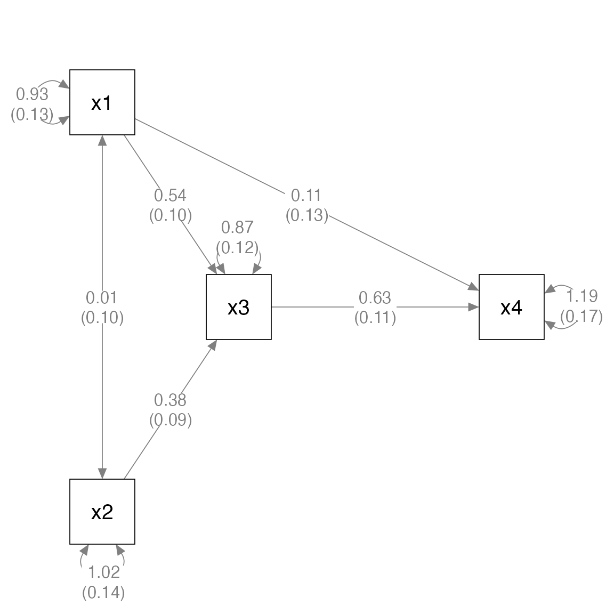
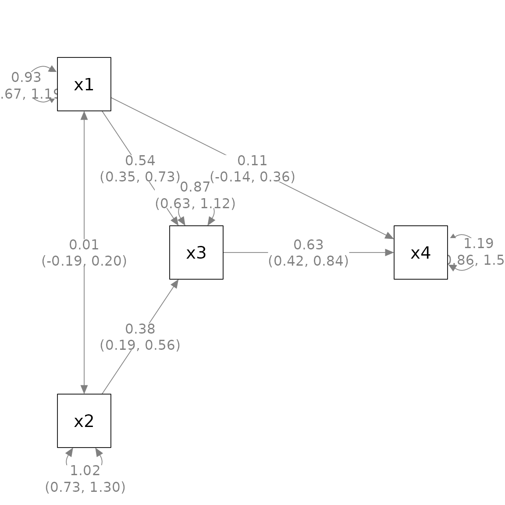
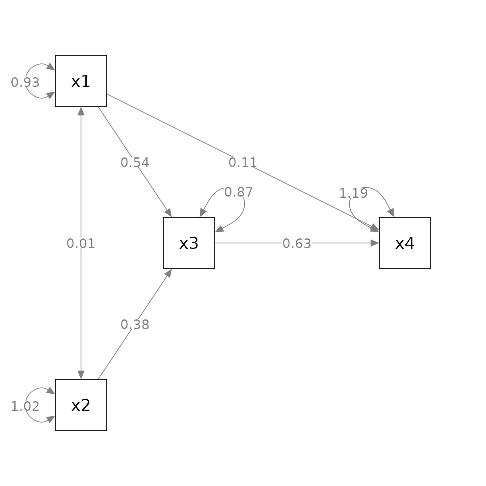
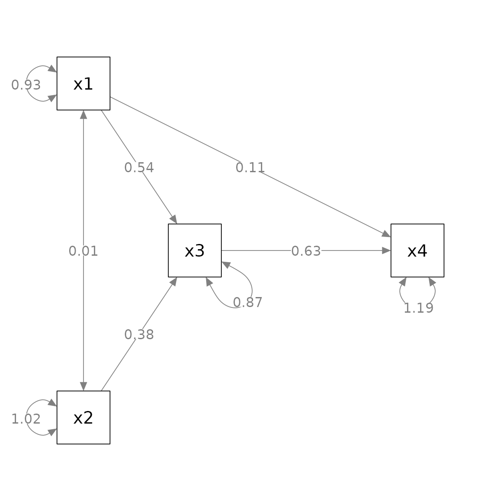
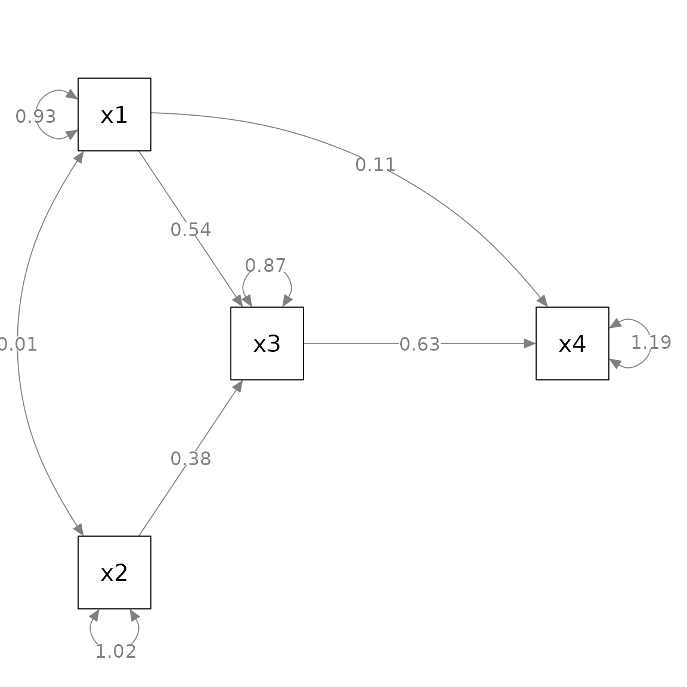
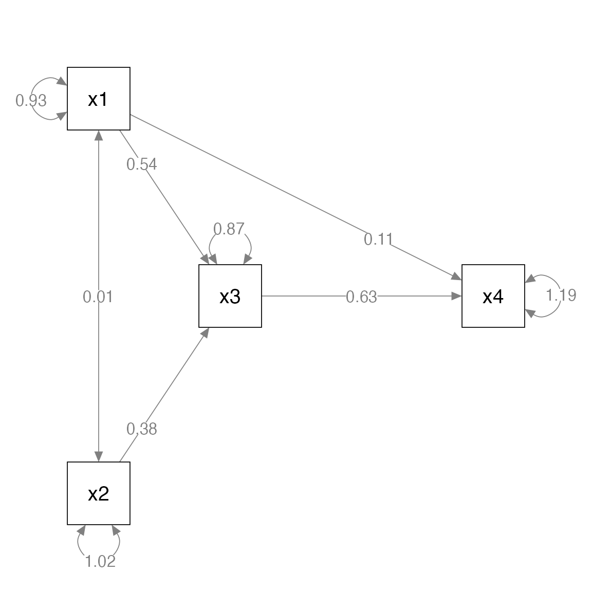
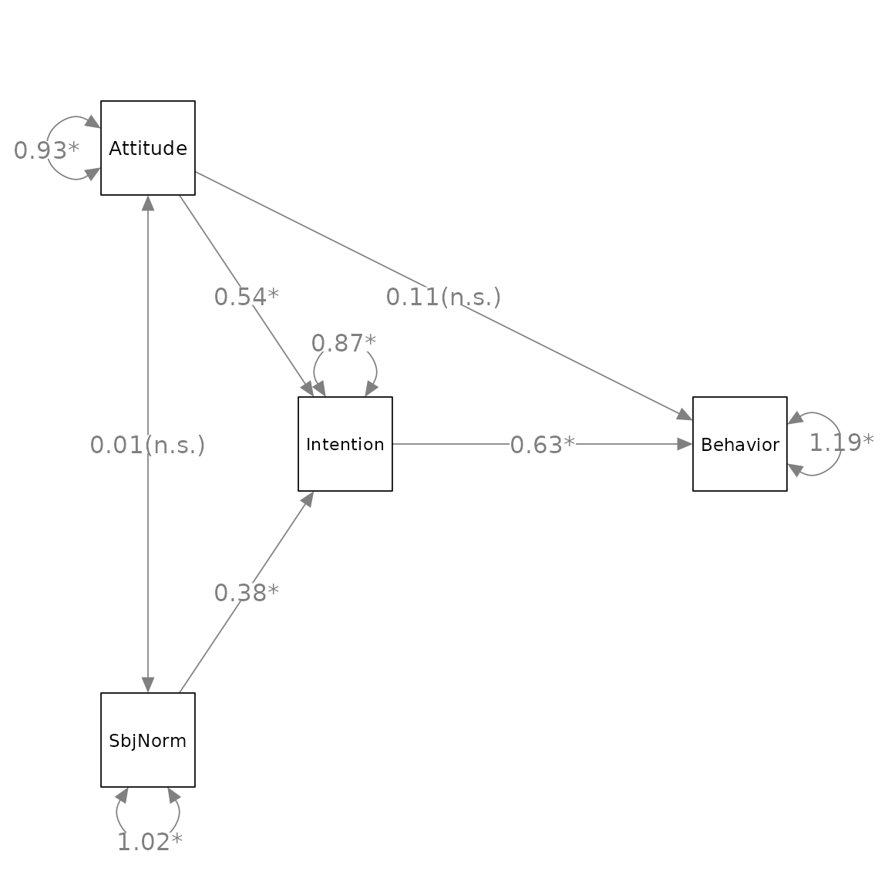
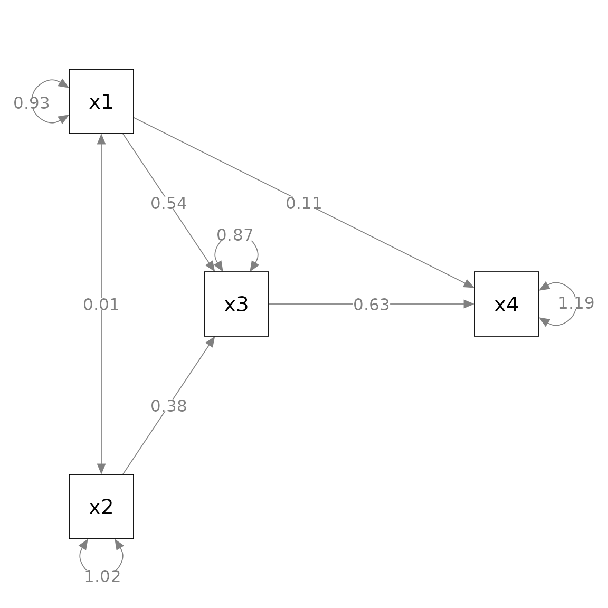
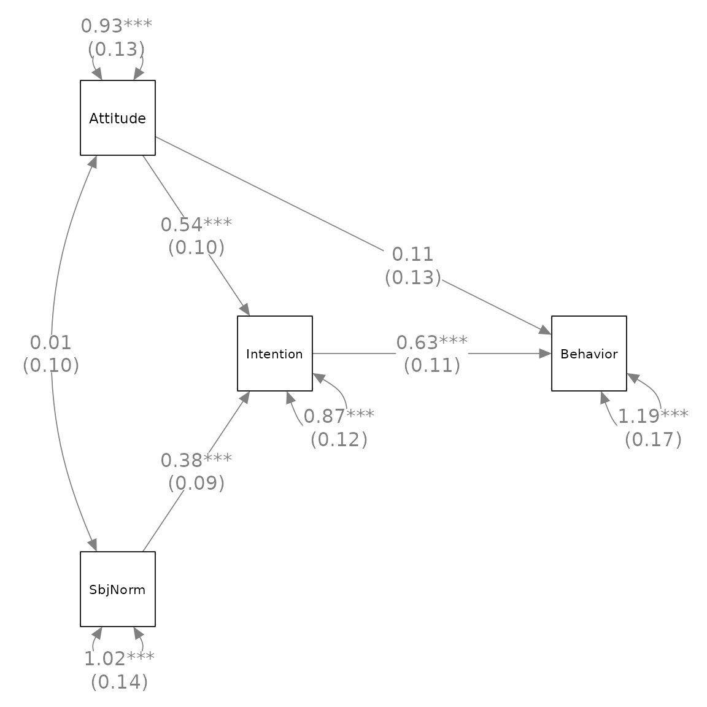

# A Quick Start Guide on Using semptools

## Introduction

The package [semptools](https://sfcheung.github.io/semptools/) ([CRAN
page](https://cran.r-project.org/package=semptools)) contains functions
that *post-process* an output from
[`semPlot::semPaths()`](https://rdrr.io/pkg/semPlot/man/semPaths.html),
to help users to customize the appearance of the graphs generated by
[`semPlot::semPaths()`](https://rdrr.io/pkg/semPlot/man/semPaths.html).

The following sections were written to be self-contained, with some
elements repeated, such that each of them can be read individually.

## Mark all parameter estimates by asterisks based on p-Value: `mark_sig`

Let us consider a simple path analysis model:

``` r

library(lavaan)
#> This is lavaan 0.6-21
#> lavaan is FREE software! Please report any bugs.
mod_pa <-
 'x1 ~~ x2
  x3 ~  x1 + x2
  x4 ~  x1 + x3
 '
fit_pa <- lavaan::sem(mod_pa, pa_example)
parameterEstimates(fit_pa)
#>   lhs op rhs   est    se     z pvalue ci.lower ci.upper
#> 1  x1 ~~  x2 0.005 0.097 0.054  0.957   -0.186    0.196
#> 2  x3  ~  x1 0.537 0.097 5.551  0.000    0.348    0.727
#> 3  x3  ~  x2 0.376 0.093 4.050  0.000    0.194    0.557
#> 4  x4  ~  x1 0.111 0.127 0.875  0.382   -0.138    0.361
#> 5  x4  ~  x3 0.629 0.108 5.801  0.000    0.416    0.841
#> 6  x3 ~~  x3 0.874 0.124 7.071  0.000    0.632    1.117
#> 7  x4 ~~  x4 1.194 0.169 7.071  0.000    0.863    1.525
#> 8  x1 ~~  x1 0.933 0.132 7.071  0.000    0.674    1.192
#> 9  x2 ~~  x2 1.017 0.144 7.071  0.000    0.735    1.298
```

This is the plot from `semPaths`.

``` r

library(semPlot)
m <- matrix(c("x1",   NA,  NA,   NA,
                NA, "x3",  NA, "x4",
              "x2",   NA,  NA,   NA), byrow = TRUE, 3, 4)
p_pa <- semPaths(fit_pa, whatLabels = "est",
           sizeMan = 10,
           edge.label.cex = 1.15,
           style = "ram",
           nCharNodes = 0, nCharEdges = 0,
           layout = m)
```



We know from the
[`lavaan::lavaan()`](https://rdrr.io/pkg/lavaan/man/lavaan.html) output
that some paths are significant and some are not. In some disciplines,
asterisks are conventionally added indicate this. However,
[`semPlot::semPaths()`](https://rdrr.io/pkg/semPlot/man/semPaths.html)
does not do this. We can use
[`mark_sig()`](https://sfcheung.github.io/semptools/reference/mark_sig.md)
to add asterisks based on the p-values of the free parameters.

``` r

library(semptools)
p_pa2 <- mark_sig(p_pa, fit_pa)
plot(p_pa2)
```


The first argument, `semPaths_plot`, is the output from
`semPaths::semPlot()`. The second argument, `object`, is the
[`lavaan::lavaan()`](https://rdrr.io/pkg/lavaan/man/lavaan.html) output
used to generate the plot. This output is needed to extract the
*p*-values.

The default labels follow the common convention: “\*” for *p* less than
.05, “\*\*” for *p* less than .01, and “\*\*\*” for p less than .001.
This can be changed by the argument `alpha` (this must be named as the
it is not the second argument). E.g.:

``` r

p_pa3 <- mark_sig(p_pa, fit_pa, alpha = c("(n.s.)" = 1.00, "*" = .01))
plot(p_pa3)
```


## Add standard error estimates to parameter estimates: `mark_se`

Let us consider a simple path analysis model:

``` r

library(lavaan)
mod_pa <-
  'x1 ~~ x2
   x3 ~  x1 + x2
   x4 ~  x1 + x3
  '
fit_pa <- lavaan::sem(mod_pa, pa_example)
parameterEstimates(fit_pa)
#>   lhs op rhs   est    se     z pvalue ci.lower ci.upper
#> 1  x1 ~~  x2 0.005 0.097 0.054  0.957   -0.186    0.196
#> 2  x3  ~  x1 0.537 0.097 5.551  0.000    0.348    0.727
#> 3  x3  ~  x2 0.376 0.093 4.050  0.000    0.194    0.557
#> 4  x4  ~  x1 0.111 0.127 0.875  0.382   -0.138    0.361
#> 5  x4  ~  x3 0.629 0.108 5.801  0.000    0.416    0.841
#> 6  x3 ~~  x3 0.874 0.124 7.071  0.000    0.632    1.117
#> 7  x4 ~~  x4 1.194 0.169 7.071  0.000    0.863    1.525
#> 8  x1 ~~  x1 0.933 0.132 7.071  0.000    0.674    1.192
#> 9  x2 ~~  x2 1.017 0.144 7.071  0.000    0.735    1.298
```

This is the plot from
[`semPlot::semPaths()`](https://rdrr.io/pkg/semPlot/man/semPaths.html).

``` r

library(semPlot)
m <- matrix(c("x1",   NA,  NA,   NA,
                NA, "x3",  NA, "x4",
              "x2",   NA,  NA,   NA), byrow = TRUE, 3, 4)
p_pa <- semPaths(fit_pa, whatLabels = "est",
           sizeMan = 10,
           edge.label.cex = 1.15,
           style = "ram",
           nCharNodes = 0, nCharEdges = 0,
           layout = m)
```


We can use
[`mark_se()`](https://sfcheung.github.io/semptools/reference/mark_se.md)
to add the standard errors for the parameter estimates:

``` r

library(semptools)
p_pa2 <- mark_se(p_pa, fit_pa)
plot(p_pa2)
```


The first argument, `semPaths_plot`, is the output from
`semPaths::semPlot()`. The second argument, `object`, is the
[`lavaan::lavaan()`](https://rdrr.io/pkg/lavaan/man/lavaan.html) output
used to generate the plot. This output is needed to extra the standard
errors.

By default, the standard errors are enclosed by parentheses and appended
to the parameter estimates, separated by one space. The argument `sep`
can be used to use another separator. For example, if `"\n"` is used,
the standard errors will be displayed below the corresponding parameter
estimates.

``` r

p_pa2 <- mark_se(p_pa, fit_pa, sep = "\n")
plot(p_pa2)
```



Similarly, one can use
[`mark_ci()`](https://sfcheung.github.io/semptools/reference/mark_se.md)
to add confidence intervals:

``` r

p_pa2_ci <- mark_ci(p_pa, fit_pa, sep = "\n")
plot(p_pa2_ci)
```



## Rotate the residuals of selected variables: `rotate_resid`

Let us consider a simple path analysis model:

``` r

library(lavaan)
mod_pa <-
 'x1 ~~ x2
  x3 ~  x1 + x2
  x4 ~  x1 + x3
 '
fit_pa <- lavaan::sem(mod_pa, pa_example)
```

This is the plot from
[`semPlot::semPaths()`](https://rdrr.io/pkg/semPlot/man/semPaths.html).

``` r

library(semPlot)
m <- matrix(c("x1",   NA,  NA,   NA,
                NA, "x3",  NA, "x4",
              "x2",   NA,  NA,   NA), byrow = TRUE, 3, 4)
p_pa <- semPaths(fit_pa, whatLabels = "est",
           sizeMan = 10,
           edge.label.cex = 1.15,
           style = "ram",
           nCharNodes = 0, nCharEdges = 0,
           layout = m)
```



Suppose we want to rotate the residuals of some variables to improve
readability.

- For `x3`, we want to place the residual to top-right corner.

- For `x4`, we want to place the residual to the top-left corner.

- For `x2`, we want to place the residual to the left.

We first need to decide the angle of placement, in degrees.

Top is 0 degree. Clockwise position is positive, and anticlockwise
position is negative.

Therefore, top-right is 45, top-left is -45, and left is -90.

We then use
[`rotate_resid()`](https://sfcheung.github.io/semptools/reference/rotate_resid.md)
to post-process the
[`semPlot::semPaths()`](https://rdrr.io/pkg/semPlot/man/semPaths.html)
output. The first argument, `semPaths_plot`, is the
[`semPlot::semPaths()`](https://rdrr.io/pkg/semPlot/man/semPaths.html)
output. The second argument, `rotate_resid_list`, is the vector to
specify how the residuals should be rotated. The name is the node for
which the residual will be rotated, and the value is the degree of
rotation. For example, to achieve the results described above, the
vector is `c(x3 = 45, x4 = -45, x2 = -90)`:

``` r

library(semptools)
my_rotate_resid_list <- c(x3 =  45,
                          x4 = -45,
                          x2 = -90)
p_pa3 <- rotate_resid(p_pa, my_rotate_resid_list)
plot(p_pa3)
```



(Note: This function accepts named vectors since version 0.2.8. Lists of
named list are still supported but not suggested. Please see
[`?rotate_resid`](https://sfcheung.github.io/semptools/reference/rotate_resid.md)
on how to use lists of named list.)

## Set the curve attributes of selected arrows: `set_curve`

Let us consider a simple path analysis model:

``` r

library(lavaan)
mod_pa <-
 'x1 ~~ x2
  x3 ~  x1 + x2
  x4 ~  x1 + x3
 '
fit_pa <- lavaan::sem(mod_pa, pa_example)
```

This is the plot from `semPaths`.

``` r

library(semPlot)
m <- matrix(c("x1",   NA,  NA,   NA,
                NA, "x3",  NA, "x4",
              "x2",   NA,  NA,   NA), byrow = TRUE, 3, 4)
p_pa <- semPaths(fit_pa, whatLabels = "est",
           sizeMan = 10,
           edge.label.cex = 1.15,
           style = "ram",
           nCharNodes = 0, nCharEdges = 0,
           layout = m)
```


Suppose we want to change the curvature of these two arrows (`edges`):

- Have the `x1 ~~ x2` covariance curved “away” from the center.

- Have the `x4 ~ x1` path curved upward.

We then use
[`set_curve()`](https://sfcheung.github.io/semptools/reference/set_curve.md)
to post-process the
[`semPlot::semPaths()`](https://rdrr.io/pkg/semPlot/man/semPaths.html)
output. The first argument, `semPaths_plot`, is the
[`semPlot::semPaths()`](https://rdrr.io/pkg/semPlot/man/semPaths.html)
output. The second argument, `curve_list`, is the list to specify the
new curvature of the selected arrows.

The “name” of each element is of the same form as `lhs-op-rhs` as in
[`lavaan::lavaan()`](https://rdrr.io/pkg/lavaan/man/lavaan.html) model
syntax. In `lavaan`, `y ~ x` denotes an arrow from `x` to `y`.
Therefore, if we want to change the curvature of the path *from* `x`
*to* `y` to -3, then the element is `"y ~ x" = -3`. Note that whether
`~` or `~~` is used does not matter.

To achieve the changes described above, we can use
`c("x2 ~~ x1" = -3, "x4 ~ x1" = 2)`, as shown below:

``` r

my_curve_list <- c("x2 ~~ x1" = -3,
                   "x4  ~ x1" =  2)
p_pa3 <- set_curve(p_pa, my_curve_list)
plot(p_pa3)
```



Note that the meaning of the value depends on which variable is in the
`from` field and which variable is in the `to` field. Therefore,
`"x2 ~~ x1" = -3` and `"x1 ~~ x2" = -3` are two different changes. If we
treat the `from` variable as the back and the `to` variable as the
front, then a *positive* number bends the line to *left*, and a
*negative* number bends the line to the *right*.

It is not easy to decide what the value should be used to set the curve.
Trial and error is needed for complicated models. The `curve` attributes
of the corresponding arrows of the `qgraph` object will be updated.

(Note: This function accepts named vectors since version 0.2.8. Lists of
named list are still supported but not suggested. Please see
[`?set_curve`](https://sfcheung.github.io/semptools/reference/set_curve.md)
on how to use lists of named list.)

## Set the positions of parameters of selected arrows: `set_edge_label_position`

Let us consider a simple path analysis model:

``` r

library(lavaan)
mod_pa <-
 'x1 ~~ x2
  x3 ~  x1 + x2
  x4 ~  x1 + x3
 '
fit_pa <- lavaan::sem(mod_pa, pa_example)
```

This is the plot from
[`semPlot::semPaths()`](https://rdrr.io/pkg/semPlot/man/semPaths.html).

``` r

library(semPlot)
m <- matrix(c("x1",   NA,  NA,   NA,
                NA, "x3",  NA, "x4",
              "x2",   NA,  NA,   NA), byrow = TRUE, 3, 4)
p_pa <- semPaths(fit_pa, whatLabels = "est",
           sizeMan = 10,
           edge.label.cex = 1.15,
           style = "ram",
           nCharNodes = 0, nCharEdges = 0,
           layout = m)
```



Suppose we want to move the parameter estimates this way:

- For the `x4 ~ x1` path, move the parameter estimates closer to `x4`.

- For the `x3 ~ x1` path, move the parameter estimates closer to `x1`.

- For the `x3 ~ x2` path, move the parameter estimates closer to `x2`.

We can use
[`set_edge_label_position()`](https://sfcheung.github.io/semptools/reference/set_edge_label_attributes.md)
to post-process the
[`semPlot::semPaths`](https://rdrr.io/pkg/semPlot/man/semPaths.html)
output. The first argument, `semPaths_plot`, is the
[`semPlot::semPaths()`](https://rdrr.io/pkg/semPlot/man/semPaths.html)
output. The second argument, `position_list`, is the list to specify the
new position of the selected arrows.

We can use a named vector to specify the changes. The “name” of each
element is of the same form as `lhs-op-rhs` as in
[`lavaan::lavaan()`](https://rdrr.io/pkg/lavaan/man/lavaan.html) model
syntax. In `lavaan`, `y ~ x` denotes an arrow from `x` to `y`.
Therefore, if we want to change the curvature of the path *from* `x`
*to* `y` to -3, then the element is `"y ~ x" = -3`. Note that whether
`~` or `~~` is used does not matter.

Therefore, the changes described above can be specified by
`c("x2 ~~ x1" = -3, "x4 ~ x1" = 2)`, as shown below:

``` r

library(semptools)
my_position_list <- c("x3 ~ x1" = .25,
                      "x3 ~ x2" = .25,
                      "x4 ~ x1" = .75)
p_pa3 <- set_edge_label_position(p_pa, my_position_list)
plot(p_pa3)
```


(Note: This function accept named vectors since version 0.2.8. Lists of
named list are still supported but not suggested. Please see
[`?set_edge_label_position`](https://sfcheung.github.io/semptools/reference/set_edge_label_attributes.md)
on how to use lists of named list.)

## Change one or more node labels: `change_node_label`

[`semPlot::semPaths()`](https://rdrr.io/pkg/semPlot/man/semPaths.html)
supports changing the labels of nodes when generating a plot through the
argument `nodeLabels`. However, if we want to use functions such as
[`mark_sig()`](https://sfcheung.github.io/semptools/reference/mark_sig.md)
or
[`mark_se()`](https://sfcheung.github.io/semptools/reference/mark_se.md),
which require information from the original results from the original
`lavaan` output, then we cannot use `nodeLabels` because these functions
do not (yet) know how to map a user-defined label to the variables in
the `lavaan` output.

One solution is to use `semptools` functions to process the `qgraph`
generated by
[`semPlot::semPaths()`](https://rdrr.io/pkg/semPlot/man/semPaths.html),
and change the node labels in *last step* to create the final plot. This
can be done by
[`change_node_label()`](https://sfcheung.github.io/semptools/reference/change_node_label.md).

Let us consider a simple path analysis model in which we use
`marg_sig()` to add asterisks to denote significant parameters:

``` r

library(lavaan)
library(semPlot)
library(semptools)
mod_pa <-
 'x1 ~~ x2
  x3 ~  x1 + x2
  x4 ~  x1 + x3
 '
fit_pa <- lavaan::sem(mod_pa, pa_example)
m <- matrix(c("x1",   NA,  NA,   NA,
                NA, "x3",  NA, "x4",
              "x2",   NA,  NA,   NA), byrow = TRUE, 3, 4)
p_pa <- semPaths(fit_pa, whatLabels = "est",
           sizeMan = 10,
           edge.label.cex = 1.15,
           style = "ram",
           nCharNodes = 0, nCharEdges = 0,
           layout = m)
```


``` r

p_pa2 <- mark_sig(p_pa, fit_pa, alpha = c("(n.s.)" = 1.00, "*" = .01))
plot(p_pa2)
```


Suppose we want change `x1`, `x2`, `x3`, and `x4` to `Attitude`,
`SbjNorm`, `Intention`, and `Behavior`, we process the graph, `p_pa2`
above, by
[`change_node_label()`](https://sfcheung.github.io/semptools/reference/change_node_label.md)
as below:

``` r

p_pa3 <- change_node_label(p_pa2,
                           c(x1 = "Attitude",
                             x2 = "SbjNorm",
                             x3 = "Intention",
                             x4 = "Behavior"),
                           label.cex = 1.1)
plot(p_pa3)
```



The second argument can be a named vector or a named list. The name of
each element is the original label (e.g., `x1` in this example), and the
value is the new label (e.g., `"Attitude"` for `x1`). Only the labels of
named nodes will be changed.

Note that usually we also set the `label.cex` argument, which is
identical to the same argument in
[`semPlot::semPaths()`](https://rdrr.io/pkg/semPlot/man/semPaths.html)
because the new labels might not fit the nodes.

## Using pipe-operator

All the functions support the `%>%` operator from `magrittr` or the
native pipe operator `|>` available since R 4.1.x. Therefore, we can
chain the post-processing.

``` r

library(lavaan)
mod_pa <-
 'x1 ~~ x2
  x3 ~  x1 + x2
  x4 ~  x1 + x3
 '
fit_pa <- lavaan::sem(mod_pa, pa_example)
```

This is the initial plot:

``` r

library(semPlot)
m <- matrix(c("x1",   NA,  NA,   NA,
                NA, "x3",  NA, "x4",
              "x2",   NA,  NA,   NA), byrow = TRUE, 3, 4)
p_pa <- semPaths(fit_pa, whatLabels = "est",
           sizeMan = 10,
           edge.label.cex = 1.15,
           style = "ram",
           nCharNodes = 0, nCharEdges = 0,
           layout = m)
```



We will do this:

- Change the curvature of `x1 ~~ x2`

- Rotate the residuals of `x1`, `x2`, `x3`, and `x4`,

- Add asterisks to denote significant test results

- Add standard errors

- Move the parameter estimate of the `x4 ~ x1` path closer to `x4`.

``` r

my_position_list <- c("x4 ~ x1" = .75)
my_curve_list <- c("x2 ~ x1" = -2)
my_rotate_resid_list <- c(x1 = 0, x2 = 180, x3 = 140, x4 = 140)
my_position_list <- c("x4 ~ x1" = .65)
# If R version 4.1.0 or above
p_pa3 <- p_pa |> set_curve(my_curve_list) |>
                  rotate_resid(my_rotate_resid_list) |>
                  mark_sig(fit_pa) |>
                  mark_se(fit_pa, sep = "\n") |>
                  set_edge_label_position(my_position_list)
plot(p_pa3)
```

    #> Loading required package: magrittr



For most of the functions, the necessary argument beside the
[`semPlot::semPaths`](https://rdrr.io/pkg/semPlot/man/semPaths.html)
output, if any, is the second element. Therefore, they can be included
as unnamed arguments. For the third and other optional arguments, such
as `sep` for
[`mark_se()`](https://sfcheung.github.io/semptools/reference/mark_se.md),
it is better to name them.

## Limitations

- Currently, if a function needs the SEM output, only `lavaan` output is
  supported.
